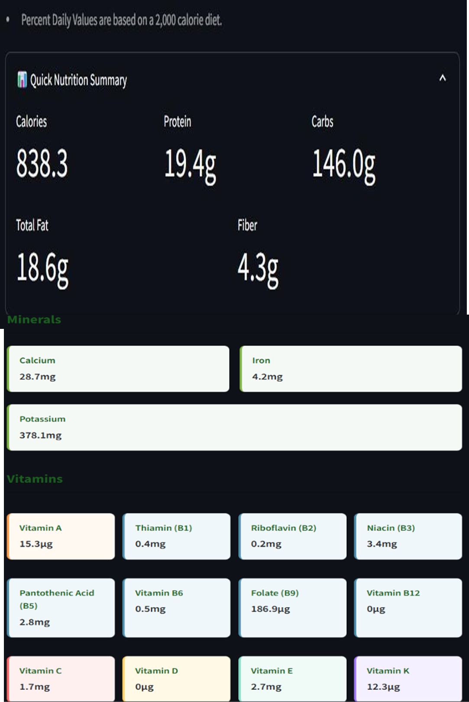

# AI-Powered Nutrient Deficiency Detection and Improvement with Food Suggestions and Goal Tracking (APNP - AI Powered Nutrition Planner)


---

## Directory Structure

```
APNP/
│
├── APNP/ # Django Backend (API services)
│ ├── api/ # Custom Django app – handles business logic & API
│ └── apnp/ # Core Django project settings
│
└── frontend/ # React Frontend
├── public/
└── src/
├── assets/
└── components/
```
---

## Demo Video

https://drive.google.com/file/d/17nf1s8ljWITj304VAytsIYH42l7L4I_e/view

---

## Project Description

**APNP** is an AI-powered system that analyzes user-reported symptoms to identify potential nutritional deficiencies. It provides personalized food recommendations, daily nutrient goals, and goal tracking, aiming to guide users toward a healthier lifestyle.

### Key Highlights

- **Deficiency Detection**  
  Uses large language models (LLMs) like Gemini to interpret symptoms and detect likely nutritional deficiencies. Displays each deficiency with a likelihood score.

- **Personalized Nutrient Goals**  
  Automatically generates daily goals for macro and micro nutrients to help combat deficiencies. Tailors goals based on lifestyle, dietary habits, health conditions, and allergies.

- **Smart Food Suggestions**  
  Offers foods rich in deficient nutrients. Filters results according to user preferences (e.g., vegetarian, allergies). Context-aware and supports follow-up queries for refining suggestions.

---

## Chatbots to Guide the User

1. **Food Suggester**  
   Recommends food items that improve identified deficiencies. Provides personalized suggestions based on user preferences. Adapts to follow-up questions to refine the list.

2. **Nutrition Analyzer**  
   Analyzes nutritional content of any food item based on user input quantity (e.g., "200g of apple"). Breaks down the nutrients into micro, macro, minerals, etc.

3. **Goal Tracker**  
   Tracks nutrients consumed during meals (Breakfast, Lunch, Snacks, Dinner). Updates progress toward daily goals and informs how much more needs to be consumed.

---

## WhatsApp Integration

A dedicated WhatsApp chatbot allows users to log their food intake without using the website. It sends daily reminders (Morning, Noon, Evening, Night) and updates the user's nutritional progress based on the foods they report.

---

## Demo Screenshots

### 1. Flow Diagram


### 2. User Registration, Symptomp based Deficiency Test


### 3. Possible Deficiencies after Test


### 4. Generating Goal for Tracking


### 5. Chatbot 1 - Food Suggester


### 6. Chatbot 2 - Nutritional Breakdown (eg: 2 Dosa)


### 7. Chatbot 3 - Goal Tracker


### 8. Whatsapp Chatbot


### 9. Goal Tracking ( From 7 and 8)


### 10. LLM Comparision - Accuracy in detecting Deficiency by different LLMs for same Person. Comparision on how exactly LLMs detect the actual deficiency of real person.


---

## Conclusion

APNP is more than just a nutrition tracker — it's an intelligent system built to personalize health and wellness using modern AI capabilities. By analyzing symptoms, customizing daily nutrient goals, and providing interactive chatbot support, it empowers users to take control of their nutritional health effortlessly.

With a seamless web interface and convenient WhatsApp integration, APNP bridges the gap between clinical insights and everyday food choices, making it a practical and innovative solution for anyone aiming to improve their diet and overall well-being.

---
